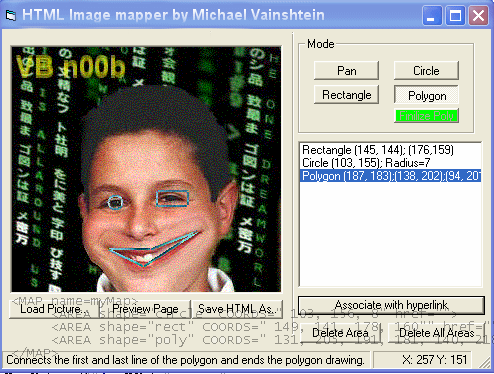



## HTML Image Mapper\!\! Every web developer should have 1\!\!

### Description

Very user-friendly util. Makes a CUSTOM AREA of an image, in a HTML page, to link to a destination and not the whole rectangular shape of the image as usual. Includes preview button! The area can be either a circle, rectangle or polygon. Enjoy & PLZ vote!!
 
### More Info
 

             |
---                |---
**Submitted On**   |2004-08-31 20:25:00
**By**             |[Michael Vainshtein](https://github.com/Planet-Source-Code/PSCIndex/blob/master/ByAuthor/michael-vainshtein.md)
**Level**          |Beginner
**User Rating**    |4.7 (28 globes from 6 users)
**Compatibility**  |VB 5\.0, VB 6\.0
**Category**       |[Internet/ HTML](https://github.com/Planet-Source-Code/PSCIndex/blob/master/ByCategory/internet-html__1-34.md)
**World**          |[Visual Basic](https://github.com/Planet-Source-Code/PSCIndex/blob/master/ByWorld/visual-basic.md)
**Archive File**   |[HTML\_Image178823912004\.zip](https://github.com/Planet-Source-Code/michael-vainshtein-html-image-mapper-every-web-developer-should-have-1__1-55922/archive/master.zip)

